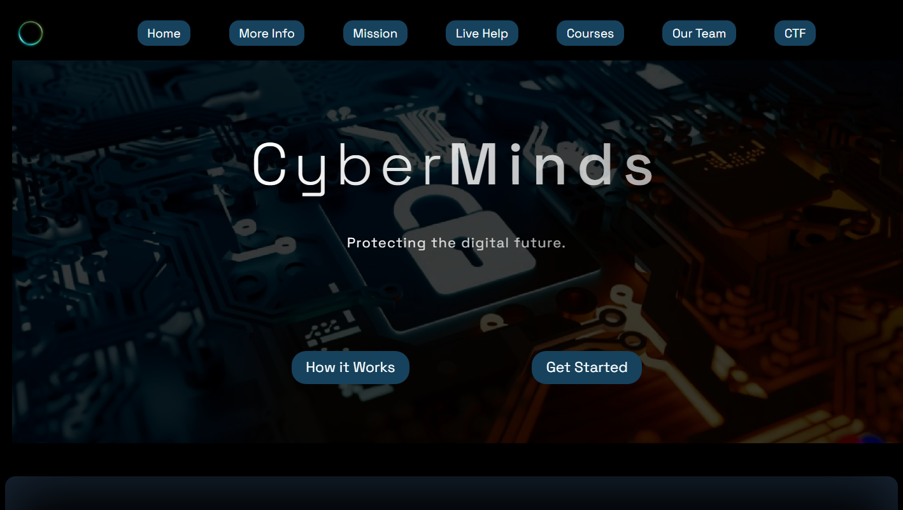
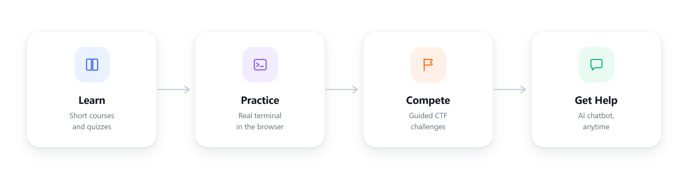

<div align="center">


# CyberMinds

Free cybersecurity education: short courses, a real browser terminal, CTF challenges, and an AI helper.

</div>

<p align="center">
  
</p>

## What It Does

CyberMinds teaches cybersecurity through short lessons and quizzes, then lets learners apply what they learned in a real Linux terminal running in the browser and a set of CTF challenges. An AI chatbot is available the whole time for help. No account needed.

## Features

- 12 self paced courses covering security fundamentals, cryptography, Linux, networking, penetration testing, and cloud security
- A real Linux terminal in the browser, backed by an isolated Docker container per session
- 6 guided CTF challenges for hands on practice
- An AI chatbot for live help
- Local progress tracking, and privacy first analytics that never collects personal data

## How It Works

<p align="center">
  
</p>

Pick a course, read the lesson, take the quiz, then practice in the terminal and try a CTF challenge. Ask the chatbot anytime.

## CTF Challenges

- Linux Basics Warmup
- Web Recon Starter
- Log Hunt
- Privilege Escalation Trace
- Incident Timeline Reconstruction
- Suspicious Beaconing

## Tech Stack

HTML, CSS, and JavaScript on the frontend. A Go backend runs the terminal API and spins up an isolated Docker container per session, deployable to Azure or Oracle Cloud with the included Terraform configs. Hosted on GitHub Pages. Playwright and Go's test tooling cover CI.

## Getting Started

```bash
git clone https://github.com/Cyber-Minds/CyberMinds.git
cd CyberMinds
npm ci
make dev
```

`make dev` starts the terminal backend in Docker and serves the site at `http://localhost:8080`.

## Contributing

See [`CONTRIBUTING.md`](.github/CONTRIBUTING.md) for guidelines. Every pull request runs lint, backend tests, and smoke tests. Licensed under MIT, see [`LICENSE`](LICENSE). Report security issues per [`SECURITY.md`](.github/SECURITY.md).
