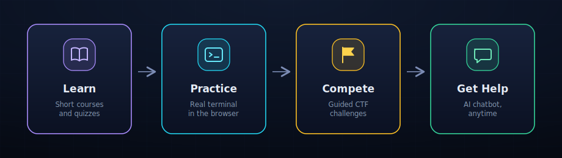
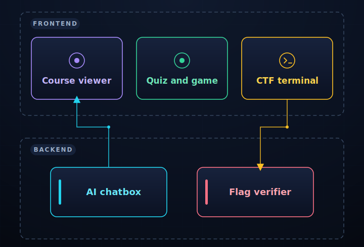
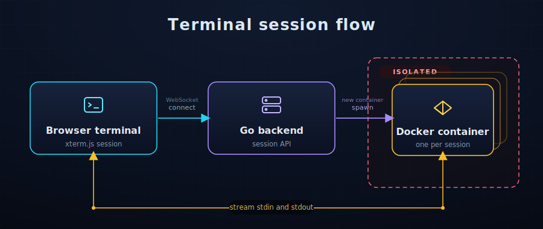

<div align="center">


# CyberMinds

Cybersecurity you actually practice, not just read about. Short courses, a real Linux terminal in your browser, CTF challenges, and an AI helper on standby. Free, no account required.

</div>

## What It Does

CyberMinds pairs short lessons and quizzes with a real Linux terminal, backed by an isolated Docker container per session, so you're running commands instead of just reading about them. Six guided CTF challenges give you something concrete to apply what you've learned to, and an AI chatbot is available the entire time if you get stuck.

## Features

- 12 self-paced courses: security fundamentals, cryptography, Linux, networking, penetration testing, cloud security
- A real Linux terminal in the browser, isolated Docker container per session
- 6 guided CTF challenges
- AI chatbot for help, anytime
- Local progress tracking, privacy-first analytics, no personal data collected

## How It Works

<p align="center">
  
</p>

Pick a course, read the lesson, take the quiz, then practice in the terminal and try a CTF challenge. Ask the chatbot anytime.

## CTF Challenges

- Linux Basics Warmup
- Web Recon Starter
- Log Hunt
- Privilege Escalation Trace
- Incident Timeline Reconstruction
- Suspicious Beaconing

## Tech Stack

HTML, CSS, and JavaScript on the frontend. A Go backend runs the terminal API and spins up an isolated Docker container per session, deployable to Azure or Oracle Cloud with the included Terraform configs. Hosted on GitHub Pages. Playwright and Go's test tooling cover CI.

## Architecture

<p align="center">
  
</p>

The frontend serves the course viewer, quiz and game, and CTF terminal. The backend runs the AI chatbox and the flag verifier that grades CTF submissions.

<p align="center">
  
</p>

Each terminal session opens a WebSocket to the Go backend, which spins up a dedicated Docker container and streams stdin and stdout back to the browser.

## Getting Started

```bash
git clone https://github.com/Cyber-Minds/CyberMinds.git
cd CyberMinds
npm ci
make dev
```

`make dev` starts the terminal backend in Docker and serves the site at `http://localhost:8080`.

---

MIT licensed, see [`LICENSE`](LICENSE).
