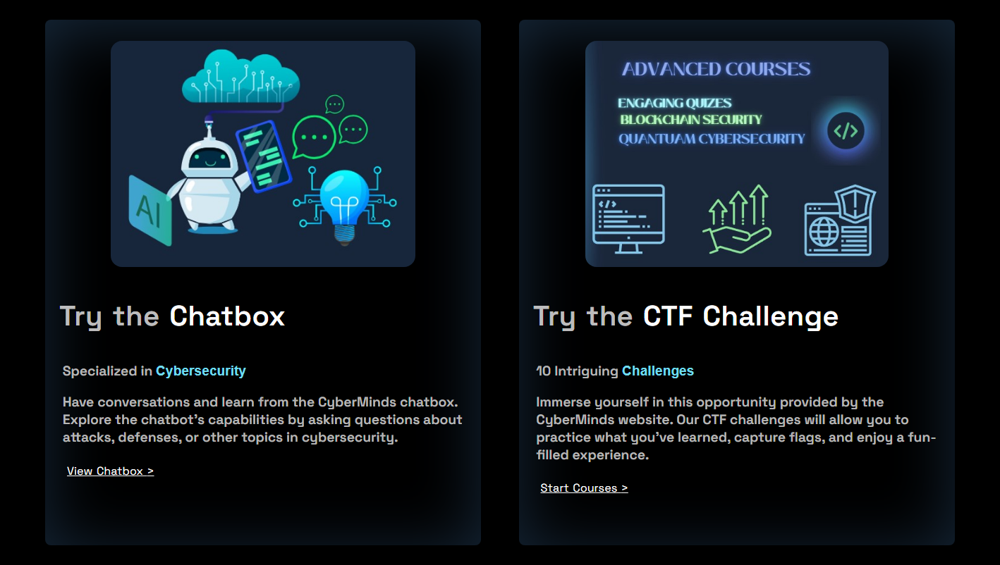
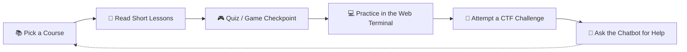
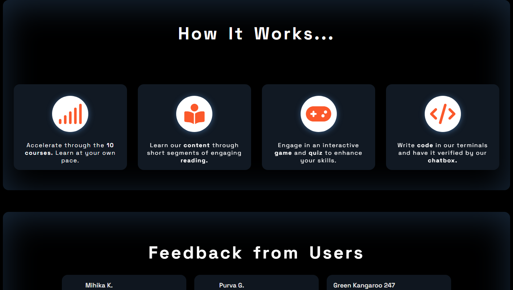
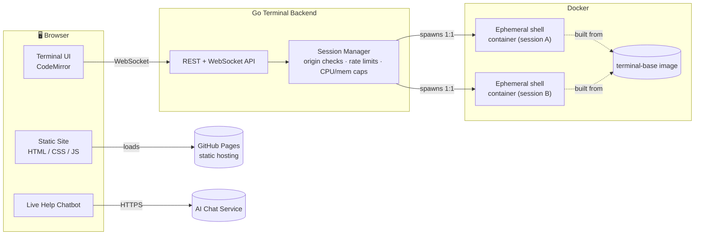
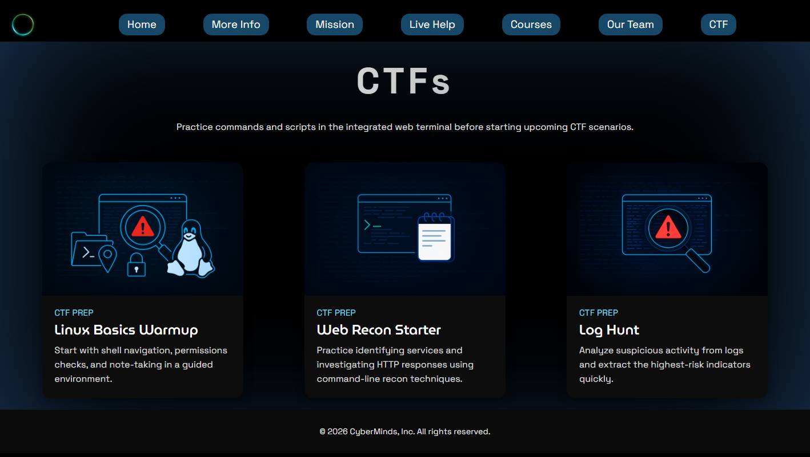
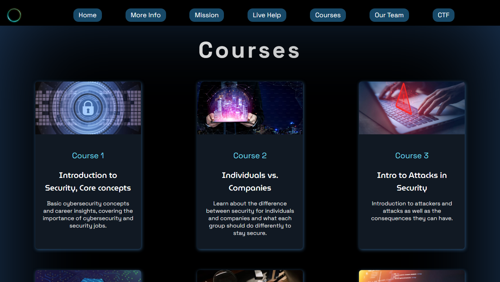
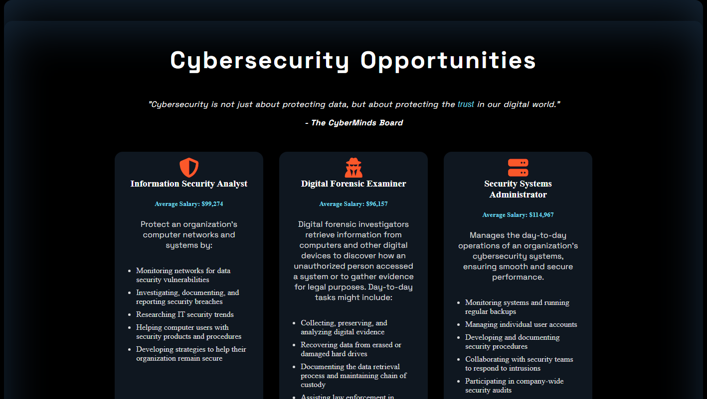
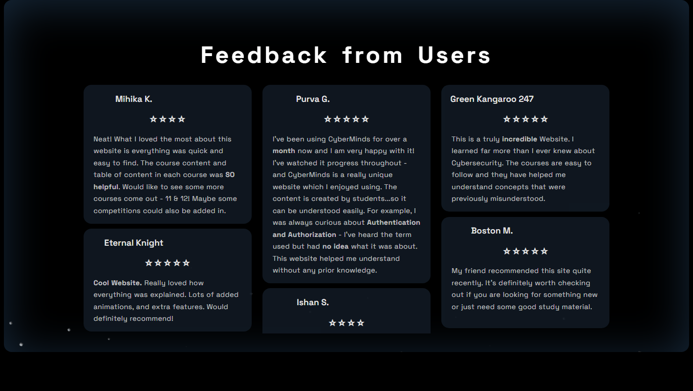
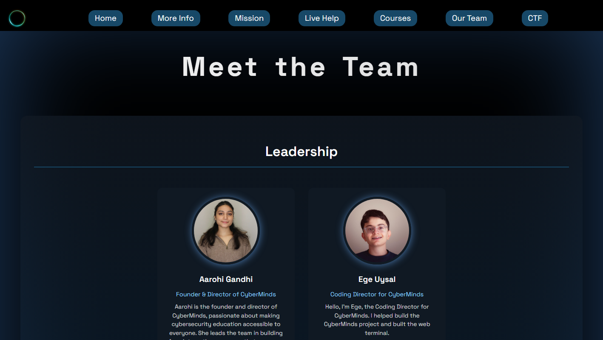

<div align="center">


# CyberMinds

**Protecting the digital future.**

A free, interactive platform that teaches cybersecurity through short courses, hands‑on CTF labs, a real sandboxed terminal, and an AI chatbot — no sign‑in required.

[](LICENSE)
[](.github/workflows/ci.yml)


[**🌐 Live Site**](https://cyber-minds.github.io/CyberMinds/) · [Report a Bug](https://github.com/Cyber-Minds/CyberMinds/issues) · [Contributing](.github/CONTRIBUTING.md)

</div>

<br />

<p align="center">
  
</p>

## Contents

- [Overview](#overview)
- [Features](#features)
- [How It Works](#how-it-works)
- [Architecture](#architecture)
- [Interactive Terminal & CTF Labs](#interactive-terminal--ctf-labs)
- [Courses](#courses)
- [Career Opportunities](#career-opportunities)
- [What Learners Say](#what-learners-say)
- [Meet the Team](#meet-the-team)
- [Tech Stack](#tech-stack)
- [Project Structure](#project-structure)
- [Getting Started](#getting-started)
- [Quality Gates & CI](#quality-gates--ci)
- [Contributing](#contributing)
- [Security](#security)
- [License](#license)

## Overview

CyberMinds exists to make cybersecurity education free, approachable, and genuinely hands‑on. Instead of long lectures, learners move through short readable lessons, prove understanding with quizzes and games, then apply it for real in a **browser‑based Linux terminal** and **Capture‑The‑Flag challenges** — with an AI chatbot on standby whenever they get stuck.

Everything runs from a static site plus one lightweight Go service, so it is cheap to host and simple to self‑host or extend.

## Features

| | |
|---|---|
| 📚 **12 Guided Courses** | Beginner‑friendly, self‑paced lessons from core security concepts through cryptography, Linux, networking, pen‑testing, and the cloud. |
| 🎮 **Quizzes & Games** | Short interactive checkpoints reinforce every lesson instead of passive reading. |
| 💻 **Real Web Terminal** | A CodeMirror‑powered editor talks to a Go backend that spins up an isolated Docker container per session — no local setup required. |
| 🚩 **6 CTF Challenges** | Guided scenarios — Linux basics, web recon, log hunting, privilege escalation, incident timelines, and beaconing detection — built to prep learners for live Capture‑the‑Flag events. |
| 🤖 **AI Live Help** | A cybersecurity‑specialized chatbot answers questions and reviews terminal work in real time. |
| 📈 **Progress Tracking** | Course and challenge progress is saved locally so learners can pick up right where they left off. |
| 🔒 **Privacy‑First Analytics** | Cookieless, PII‑stripped event tracking (via Umami) — no accounts, no personal data ever leaves the browser. |
| 📱 **No Sign‑In, Mobile‑Ready** | The full experience works instantly, on any device, with zero accounts or paywalls. |

<p align="center">
  
</p>

## How It Works



<p align="center">
  
</p>

## Architecture

The site itself is a static, dependency‑free front end. The one dynamic piece — the web terminal — is served by a small Go API that launches an isolated, ephemeral Docker container per session.



Each learner gets their own throwaway container instead of a shared shell, so one session can't see or affect another. Session limits, origin checks, and resource caps are enforced in the Go backend before a container is ever created — see [`terminal/docs/REFERENCE.md`](terminal/docs/REFERENCE.md) for the full design. Deployable Terraform stacks for both Azure and Oracle Cloud (`terminal/infra/`) stand up that backend on a real VM with a valid TLS certificate.

## Interactive Terminal & CTF Labs

<p align="center">
  
</p>

The same terminal backend powers a set of guided **CTF prep** scenarios that build real command‑line muscle before learners face open‑ended challenges:

| Challenge | Focus |
|---|---|
| 🐧 **Linux Basics Warmup** | Shell navigation, permission checks, and note‑taking in a guided environment. |
| 🌐 **Web Recon Starter** | Identifying services and investigating HTTP responses with command‑line recon techniques. |
| 🔎 **Log Hunt** | Analyzing suspicious activity in logs and extracting the highest‑risk indicators quickly. |
| 🔑 **Privilege Escalation Trace** | Correlating auth and sudo activity to find the escalation path and the impacted account. |
| 🕒 **Incident Timeline Reconstruction** | Rebuilding the chronological flow of an incident from mixed security events. |
| 📡 **Suspicious Beaconing** | Spotting periodic callback patterns through user‑agent and interval analysis. |

## Courses

Twelve self‑paced courses take learners from first principles to cloud‑era threats. Every course mixes short articles, quizzes, and games so concepts stick before moving on.

<p align="center">
  
</p>

| # | Course |
|---|---|
| 01 | Introduction to Security, Core Concepts |
| 02 | Individuals vs. Companies |
| 03 | Intro to Attacks in Security |
| 04 | Intro to Defensive Measures in Security |
| 05 | Cryptography |
| 06 | Intro to Linux |
| 07 | Attacks in Security 2 |
| 08 | Your Cybersecurity Position |
| 09 | Penetration Testing |
| 10 | Networking for Security |
| 11 | Cybersecurity in the Cloud |
| 12 | Emerging Technologies & the Future of Cybersecurity *(coming soon)* |

## Career Opportunities

Beyond the courses, CyberMinds points learners toward what comes next — real roles, the skills they require, and how the platform's labs map onto them.

<p align="center">
  
</p>

## What Learners Say

<p align="center">
  
</p>

## Meet the Team

CyberMinds is built and maintained by a student‑led team of contributors passionate about making security education accessible to everyone.

<p align="center">
  
</p>

## Tech Stack

| Layer | Technology |
|---|---|
| Frontend | HTML5, CSS3, vanilla JavaScript, CodeMirror 6 |
| Build Tooling | Rollup, ESLint (Airbnb base), Prettier |
| Terminal Backend | Go, REST + WebSocket API |
| Sandboxing | Docker (one ephemeral container per session), Caddy |
| Cloud Deploy | Terraform (Azure VM / Oracle Cloud free tier) |
| Analytics | Umami (privacy‑first, cookieless) |
| Testing | Playwright (frontend smoke tests), Go `testing` (backend) |
| Hosting | GitHub Pages (static site) |
| CI/CD | GitHub Actions |

## Project Structure

```text
CyberMinds/
├── HTML/                 # Page markup, one folder per course
├── CSS/                  # Stylesheets (site-wide + per-feature)
├── Javascript/           # Site behavior, chat, terminal client, editors
├── Images/               # Site + README media
├── terminal/             # Go backend, Docker images, Compose stacks
│   ├── backend/          # REST + WebSocket API, session manager
│   ├── docs/REFERENCE.md # Terminal architecture & security design
│   └── docker-compose.yml
├── index.html            # Site entry point
├── Makefile               # `make dev` / `make site` / `make terminal-*`
└── package.json           # Frontend lint/format scripts
```

## Getting Started

**Prerequisites:** Node.js 20+, Go (see `terminal/backend/go.mod`), Docker, and a static server such as `live-server`.

```bash
# 1. Clone the repository
git clone https://github.com/Cyber-Minds/CyberMinds.git
cd CyberMinds

# 2. Install frontend tooling
npm ci

# 3. Start the terminal backend + static site together
make dev
```

`make dev` builds and starts the Dockerized terminal backend, then serves the static site with `/api` and `/health` proxied to it. Visit `http://localhost:8080` to explore the site with a fully working terminal.

Prefer to run pieces separately? Use `make terminal-up` to start just the backend, or `make site` to serve the front end against an already‑running API.

## Quality Gates & CI

Every push and pull request to `main` runs three required gates via [GitHub Actions](.github/workflows/ci.yml):

| Gate | What it checks |
|---|---|
| 🧹 **Frontend Lint** | `npm run lint:frontend` — ESLint (Airbnb base) across all site and terminal‑client JavaScript, plus a check that no HTML file is empty. |
| ✅ **Backend Tests & Coverage** | `go build`, `go vet`, and `go test` for the terminal backend, with a **minimum 60% coverage gate** enforced by `scripts/check-coverage.sh`. |
| 🎭 **Frontend Smoke Tests** | `npm run test:smoke` — Playwright walks the core student journey (home → courses → CTF → mock terminal → challenge completion) headlessly in Chromium. |

A scheduled workflow also opens a weekly async status issue every Friday to track blockers, completed work, and next‑week priorities.

## Contributing

Contributions are welcome — bug fixes, new features, course content, and documentation all count. Please read [`.github/CONTRIBUTING.md`](.github/CONTRIBUTING.md) before opening a PR; it covers coding conventions, the required lint/test gates above, and the runtime upgrade policy for Go and Node.

Also see the [Code of Conduct](.github/CODE_OF_CONDUCT.md), which applies to all project spaces.

## Security

Found a vulnerability? Please **do not** open a public issue. Report it responsibly as described in [`SECURITY.md`](.github/SECURITY.md).

## License

Released under the [MIT License](LICENSE) — free to use, modify, and distribute.

<div align="center">

**Made with 💙 by the CyberMinds team.**

[⬆ Back to top](#cyberminds)

</div>
